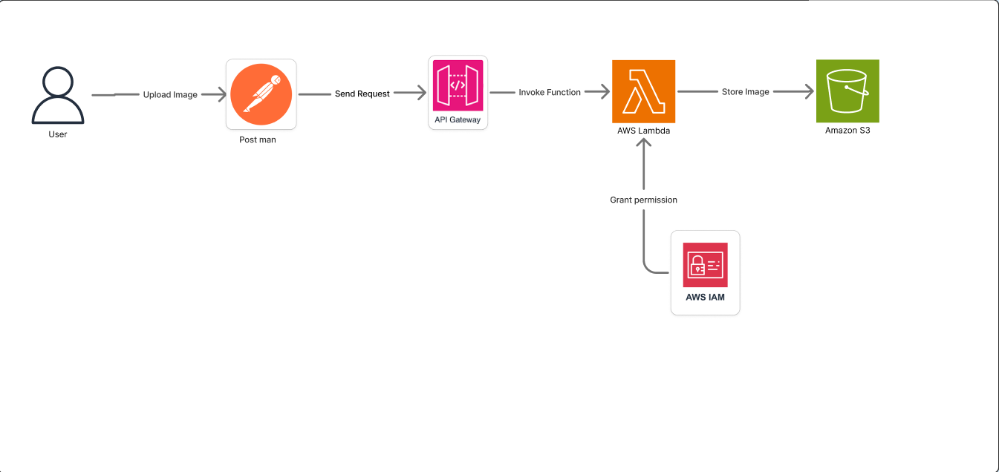

# 📘 Project Proposal: Upload Image to Amazon S3 using API Gateway and AWS Lambda

## 👨‍🎓 Thông Tin Sinh Viên

- **Họ và Tên:** Vũ Yên Định  
- **Trường Đại Học:** Trường Đại học Công nghệ Tp.HCM (Hutech) 
- **MSSV:** 2180602169  
- **Email:** vuyendinh999@gmail.com  
- **GitHub:** [https://github.com/yendinh2003](https://github.com/yendinh2003)

---

# 📄 1. Executive Summary

## Tổng quan đề tài

Trong thời đại số hóa hiện nay, nhu cầu lưu trữ hình ảnh trực tuyến ngày càng tăng nhanh, đặc biệt trong các ứng dụng như thương mại điện tử, mạng xã hội, hệ thống quản lý nhân sự, y tế, và giáo dục. Tuy nhiên, việc xây dựng một hệ thống upload ảnh truyền thống yêu cầu hạ tầng máy chủ phức tạp, chi phí duy trì cao, khó mở rộng và dễ gặp rủi ro bảo mật.

Đề tài này đề xuất một hệ thống upload ảnh đơn giản, an toàn và hiệu quả bằng cách sử dụng **Amazon S3** để lưu trữ, **API Gateway** để tạo endpoint HTTP và **AWS Lambda** để xử lý logic tải ảnh. Đây là giải pháp theo mô hình **Serverless**, không yêu cầu duy trì máy chủ truyền thống, tiết kiệm chi phí và dễ dàng mở rộng.

## Mục tiêu

- Thiết kế và triển khai API upload ảnh sử dụng Postman.
- Tích hợp AWS Lambda và S3 để xử lý và lưu trữ ảnh.
- Áp dụng chính sách bảo mật theo chuẩn IAM để đảm bảo an toàn.
- Triển khai toàn bộ bằng AWS Console (không dùng Postman về sau nếu tích hợp UI).

## Lợi ích kinh doanh

- Tiết kiệm chi phí hạ tầng nhờ mô hình serverless.
- Đáp ứng nhanh các nhu cầu lưu trữ ảnh quy mô nhỏ đến lớn.
- Có thể mở rộng thành hệ thống quản lý file ảnh đầy đủ cho web/app.
- Phù hợp với các công ty startup, nhóm phát triển nhỏ hoặc sinh viên.

## Chi phí đầu tư và thời gian

| Hạng mục                  | Ước tính                |
|---------------------------|--------------------------|
| Thời gian hoàn thành      | 7 - 10 ngày              |
| Chi phí AWS               | Gần như miễn phí (Free Tier) |
| Nhân sự                   | 1 người                  |
| Công cụ sử dụng           | AWS Console, Postman     |

## Chỉ số thành công kỳ vọng

- 98% ảnh được upload thành công.
- API phản hồi < 3 giây.
- Tăng tốc độ phát triển hệ thống ảnh cho ứng dụng.
- Hệ thống hoạt động ổn định, dễ tái sử dụng.

---

# 🎯 2. Problem Statement

## Phân tích hiện trạng

Rất nhiều ứng dụng cần chức năng upload ảnh, từ những việc đơn giản như ảnh đại diện người dùng, đến các ứng dụng lớn như lưu trữ tài liệu, hóa đơn, ảnh chứng minh nhân dân, bằng lái xe hoặc tài liệu y tế.

Thông thường, các hệ thống truyền thống sử dụng:

- Server tự triển khai (Node.js, PHP, v.v.).
- Lưu ảnh trong thư mục nội bộ hoặc trên ổ đĩa đính kèm.
- Quản lý quyền truy cập thủ công.
- Phải xử lý định dạng ảnh, mã hóa base64 hoặc form-data.

Những hệ thống này dẫn đến nhiều vấn đề:

- **Chi phí cao**: Cần server mạnh, dung lượng lớn, bảo trì liên tục.
- **Bảo mật yếu**: Ảnh có thể bị truy cập trái phép nếu không có ACL tốt.
- **Khó mở rộng**: Khi có nhiều người dùng đồng thời, server dễ quá tải.
- **Khó tích hợp**: Frontend cần chờ backend hoàn thành API riêng biệt.

## Tác động

| Vấn đề                     | Tác động thực tế         |
|----------------------------|---------------------------|
| Phát triển backend upload  | Mất thời gian triển khai và test |
| Lưu ảnh nội bộ             | Rủi ro bảo mật, backup phức tạp |
| Server overload            | Mất trải nghiệm người dùng |
| Thiếu chuẩn hóa            | Khó mở rộng về sau        |

## Các bên liên quan

- **Frontend Developer**: cần API sẵn sàng để upload ảnh.
- **DevOps**: tốn công cấu hình lưu trữ và phân quyền.
- **Người dùng cuối**: cần hệ thống nhanh, ổn định, không lỗi ảnh.

## Nếu không giải quyết

- Chậm tiến độ dự án khi phụ thuộc backend.
- Tăng chi phí vận hành server không cần thiết.
- Khó kết nối hệ thống ảnh với các công nghệ hiện đại như AI, OCR, Vision AI.

## Cơ hội

- Sử dụng AWS giúp tiết kiệm thời gian triển khai.
- Mô hình serverless cho phép mở rộng dễ dàng.
- Dữ liệu lưu trữ ảnh trên S3 có thể tích hợp AI hoặc phân tích ảnh.

---
---

# 🏗️ 3. Solution Architecture

### 3.1 Architecture Overview

Sơ đồ:





### 3.2 AWS Services Used

| Service        | Mục đích sử dụng                                           |
|----------------|------------------------------------------------------------|
| S3             | Lưu trữ ảnh đầu vào                                        |
| API Gateway    | Giao tiếp với client (REST API)                           |
| Lambda         | Xử lý ảnh, gọi S3 API                                     |
| IAM            | Gán quyền truy cập giữa các dịch vụ                       |
| CloudWatch     | Ghi log, theo dõi lỗi và performance                       |

### 3.3 Component Design

- **API Gateway**:
  - Phương thức: `POST`
  - Authentication: Không/Yêu cầu IAM (có thể mở rộng)

- **Lambda**:
  - Input: ảnh encode base64 hoặc multipart
  - Output: ghi vào S3 theo timestamp/user

- **S3**:
  - Tên Bucket: `upload-images-bucket`
  - Đặt quyền chỉ cho Lambda upload.

### 3.4 Security Architecture

- **IAM Role** riêng cho Lambda có quyền `PutObject` lên S3.
- Không mở quyền public cho bucket.
- Mã hóa dữ liệu lưu trữ (SSE-S3 hoặc SSE-KMS).
- Sử dụng throttling request ở API Gateway để tránh DDoS.

### 3.5 Scalability

- Lambda tự động scale nếu có 1000+ ảnh cùng lúc.
- Không cần máy chủ vật lý hoặc EC2.
- Có thể kết hợp với SNS/SQS nếu mở rộng quy trình xử lý.

---

# 🔧 4. Technical Implementation

### 4.1 Implementation Phases

| Giai đoạn               | Mô tả                                     | Thời gian |
|--------------------------|--------------------------------------------|-----------|
| Phân tích & Thiết kế     | Phân tích API, chọn cấu trúc S3            | 3 ngày    |
| Phát triển & Triển khai  | Tạo API Gateway, viết Lambda, cấu hình IAM | 7 ngày    |
| Kiểm thử & Log           | Postman test, theo dõi log CloudWatch      | 3 ngày    |
| Viết tài liệu & hoàn tất | Hướng dẫn sử dụng, viết Readme             | 3 ngày    |

### 4.2 Technical Requirements

- Lambda runtime: Node.js hoặc Python
- S3 bucket có versioning và policy phù hợp
- API Gateway định tuyến đúng Lambda
- Định dạng ảnh hỗ trợ: JPG, PNG, HEIC

### 4.3 Testing Strategy

- Test đơn hàm Lambda bằng AWS Console.
- Test toàn bộ flow bằng Postman (gửi ảnh → nhận phản hồi).
- Xử lý lỗi: ảnh sai format, kích thước lớn, null ảnh.

### 4.4 Deployment Plan

- Tạo cấu trúc qua AWS Console.
- Sau khi thử nghiệm thành công, sử dụng CloudFormation cho IaC (Infrastructure as Code).

---

# 📅 5. Timeline & Milestones

| Mốc chính                      | Mô tả                                            | Ngày dự kiến |
|-------------------------------|--------------------------------------------------|--------------|
| Hoàn thành thiết kế            | Phác thảo kiến trúc                              | D+3          |
| Tạo API Gateway + Lambda       | Endpoint hoạt động + ghi log                     | D+7          |
| Kết nối S3 và upload ảnh       | Gửi ảnh qua Postman thành công                   | D+10         |
| Viết tài liệu sử dụng          | Có file hướng dẫn kỹ thuật                       | D+12         |

---

# 💰 6. Budget Estimation

### AWS Free Tier

- **Lambda**: 1 triệu request/tháng miễn phí
- **S3**: 5 GB lưu trữ, 20.000 GET, 2.000 PUT
- **API Gateway**: 1 triệu request/tháng

### Phát sinh (nếu vượt Free Tier)

| Dịch vụ       | Đơn giá                       |
|----------------|-------------------------------|
| Lambda         | $0.20 / 1 triệu request        |
| S3             | $0.023/GB/tháng                |
| API Gateway    | $3.5 / 1 triệu request         |

### ROI

- Với chi phí gần như 0 → ROI cao trong 6 tháng nếu áp dụng nội bộ hoặc dự án thực tế.

---

# ⚠️ 7. Risk Assessment

| Loại rủi ro    | Mô tả                                      | Giảm thiểu                        |
|----------------|---------------------------------------------|-----------------------------------|
| Kỹ thuật        | API Gateway không gọi đúng Lambda          | Test kỹ endpoint trước sản xuất  |
| Bảo mật         | Lộ key S3 hoặc quyền upload                 | Sử dụng IAM Role và giới hạn quyền|
| Performance     | Quá tải khi nhiều ảnh cùng lúc             | Lambda tự scale, tối ưu timeout  |

---

# 🎯 8. Expected Outcomes

## ✅ Success Metrics

- **Kỹ thuật**:  
  - Thời gian phản hồi API khi upload ảnh < **3 giây**.  
  - Tỷ lệ thành công khi upload ảnh đạt **≥ 98%**.  
  - Ảnh được lưu đúng định dạng, đúng bucket, không trùng lặp tên.

- **Học tập**:  
  - Hiểu và triển khai được kiến trúc serverless sử dụng AWS Lambda, API Gateway và S3.  
  - Có thể trình bày và bảo vệ đề tài trước giảng viên hoặc mentor.

---

## 🕒 Short-term Benefits (0 – 6 tháng)

- **Nắm vững quy trình triển khai hệ thống upload ảnh không dùng máy chủ**.
- **Làm chủ quy trình sử dụng dịch vụ AWS phổ biến** như IAM, Lambda, API Gateway, S3.
- Áp dụng kiến thức vào báo cáo học phần, bài thuyết trình, hoặc bài nộp thực tập.

---

## 📈 Medium-term Benefits (6 – 18 tháng)

- **Tái sử dụng kiến thức và code đề tài** vào các đồ án lớn, khóa luận tốt nghiệp hoặc các project freelance nhỏ.
- Tự tin hơn khi ứng tuyển vào vị trí **intern hoặc fresher backend/cloud** tại các công ty sử dụng AWS.

---

## 🧠 Long-term Value (18+ tháng)

- Hình thành tư duy thiết kế hệ thống theo kiến trúc cloud-native, microservice, serverless.
- Có thể mở rộng đề tài thành một module trong hệ thống quản lý người dùng, app ảnh, hoặc portfolio backend.

---

## 😊 User Experience Improvements

- Cung cấp API đơn giản, dễ sử dụng cho frontend/mobile team.
- Tốc độ upload nhanh, phản hồi rõ ràng giúp người dùng dễ thao tác và test hệ thống.

---

## 🚀 Strategic Capabilities Gained

- Trang bị tư duy cloud-first và sử dụng **dịch vụ AWS thực tế**.
- Làm quen với quy trình xây dựng sản phẩm kỹ thuật hoàn chỉnh từ A đến Z.
- Góp phần vào portfolio cá nhân phục vụ học tập và tìm việc sau này.


# 📎 Appendices

## A. Sample Request Body (base64)

```json
{
  "fileName": "demo.jpg",
  "fileData": "base64_encoded_string_here"
}
```
## B. IAM Role Policy Sample
```
{
  "Effect": "Allow",
  "Action": "s3:PutObject",
  "Resource": "arn:aws:s3:::upload-images-bucket/*"
}
```
## C. Architecture Diagram

### 🔗 D. References

- [📘 AWS Lambda Docs](https://docs.aws.amazon.com/lambda/)
- [🌐 API Gateway Docs](https://docs.aws.amazon.com/apigateway/)
- [🗂️ Amazon S3 Docs](https://docs.aws.amazon.com/s3/)
